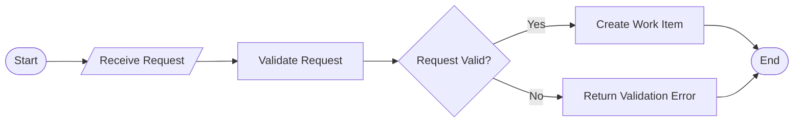
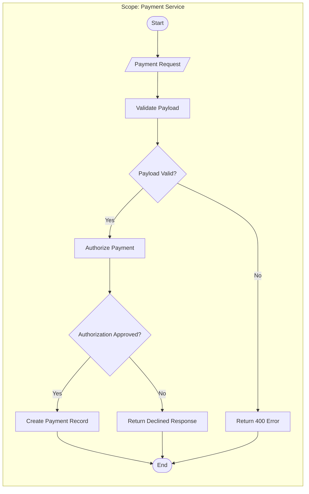

# Diagram Standardization Training Manual Proposal (v0.2 Draft)

Purpose: Create a training manual that helps new project members understand a project quickly from diagrams and documentation, even after original developers leave.

Status since v0.1: Core scope, rubric, and mandatory structure were defined; mentor decision points were identified; this v0.2 draft converts open questions into recommended defaults to accelerate pilot start.

Primary audience: Mentors and project reviewers (approval and governance), new joiners (main learners), and existing SQL/RPA developers who create or consume diagrams.

Training promise: After this training, a learner can produce standardized, high-readability process-flow diagrams with minimal ambiguity so newcomers can understand project workflows quickly.

## Scope And Policy
- Scope model (project-by-project): fixed core + variable project overlay.
- Core (always in scope): process-flow standardization rules, ambiguity reduction rules, review checklist, scoring rubric.
- Project overlay (defined per project): domain-specific symbols/terms, extra mandatory sections if needed, stricter exception rules.
- Diagram type policy (v1): mandatory process flow; sequence and full C4 layers are deferred to v1.1+.
- Policy boundary: projects can add stricter checks/thresholds, but cannot remove core mandatory sections, error-flow requirements, or cross-project review.

## v1 Recommended Defaults
- Governance: owner is Diagram Standards Owner (single accountable role); approver is Mentor Committee (minimum 2 reviewers); change control is a monthly review window with versioned updates.
- Notation default: Terminator (Start/End), Process (action step), Decision (yes/no branch), Data (input/output), Connector/Arrow (flow direction), optional Swimlane (owner/team boundary).
- Baseline method: 4-week period before pilot start, measured per diagram, sourced from review logs and clarification threads, with at least 10 diagrams.
- Baseline formulas:
	- Clarification questions per diagram = total clarification questions / total reviewed diagrams
	- Rework count per diagram = total rework events / total reviewed diagrams
	- Reviewer disagreement rate = diagrams with score delta > 10 points / total cross-reviewed diagrams
	- Time-to-understand median = median minutes for cross-project reviewer to explain core workflow correctly

## Standards
- Mandatory diagram structure: Title, Legend, Scope boundary, Main flow, Error flow, Assumptions.
- Labeling standard (locked): Verb + Object (for example: Validate Invoice, Create Shipment, Retry Payment).
- Clarification policy (locked): annotate assumptions, raise clarification requests, never silently guess.
- Reviewer model (locked): reviewer A reviews project B diagrams; reviewer is not from the original project team; outcome includes alignment discussion.

## Pilot And Metrics
- Pilot design: sample size 10 diagrams, self-paced learner format, project-by-project rollout.
- Pilot execution plan (6 weeks):
	1. Week 1: capture baseline metrics and freeze v1 notation set.
	2. Week 2: run onboarding and produce first redraw set.
	3. Week 3: perform cross-project reviews and collect rubric scores.
	4. Week 4: rework diagrams based on review outcomes.
	5. Week 5: run time-to-understand tests with independent reviewers.
	6. Week 6: compare baseline vs pilot results and decide go/no-go.
- Success metrics: primary target is 40% reduction in clarification questions per diagram within 6 weeks; supporting metrics are reviewer disagreement rate, rework count, time-to-understand test, and defect leakage to implementation.
- Time-to-understand target (locked): <= 3 minutes for core workflow comprehension by a cross-project reviewer.

## Rubric And Defects
- Draft scoring rubric (100 points): structural completeness 25, clarity of labels/ownership 25, flow logic/direction 20, error-path completeness 15, notation/abstraction consistency 15.
- Pass criteria: total score >= 85 and no critical defects.
- Critical defects (auto-fail): missing title, missing legend, missing scope boundary, no error flow where failure paths are expected, ambiguous/conflicting flow direction, missing owner for key decisions.

## Mentor Decision Log
| Decision Area | Proposed Default | Final Decision | Owner | Date |
| --- | --- | --- | --- | --- |
| Manual owner and approver model | Single owner + 2-person mentor committee | TBD | TBD | TBD |
| Final notation set for v1 | Starter set in this document | TBD | TBD | TBD |
| Baseline capture method | 4-week historical review window | TBD | TBD | TBD |
| Project-level stricter thresholds | Allowed if core rules remain | TBD | TBD | TBD |

## Notation Reference
Starter notation set for v1: Terminator (Start/End), Process (action step), Decision (yes/no branch), Data (input/output), Connector/Arrow (flow direction), optional Swimlane (owner/team boundary). Legend must define all symbols used.

Shape mapping:
- Terminator (Start/End): node([Start])
- Process step: node[Validate Invoice]
- Decision: node{Invoice Valid?}
- Data/Input/Output: node[/Invoice Data/]
- Flow direction: flowchart LR with explicit arrows

Minimal notation example:

Standardized template example (v1):

Drawer rules (non-negotiable):
- Use Verb + Object for all process labels.
- Every decision node must have labeled outgoing branches (for example: Yes/No).
- Include at least one explicit error path where failures are realistic.
- Keep one abstraction level per diagram (do not mix business-level and low-level implementation steps).

## Evidence Package And Rollout Gate
Each participant submits:
- One original diagram (before)
- One standardized redraw (after)
- Self-score using rubric
- Cross-project peer review score
- Short delta note: what ambiguity was removed

Proceed to full rollout if all conditions are met:
- Clarification questions per diagram reduced by at least 40%
- Time-to-understand median is 3 minutes or less
- At least 80% of pilot diagrams pass on first review
- No unresolved critical defects in final pilot submission set
